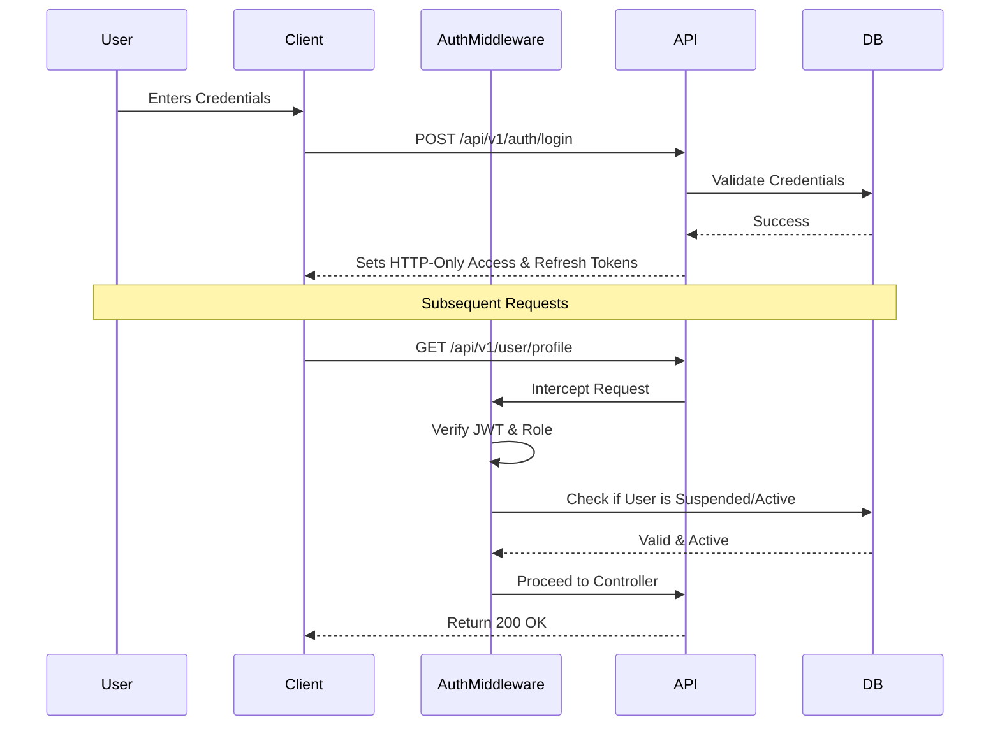
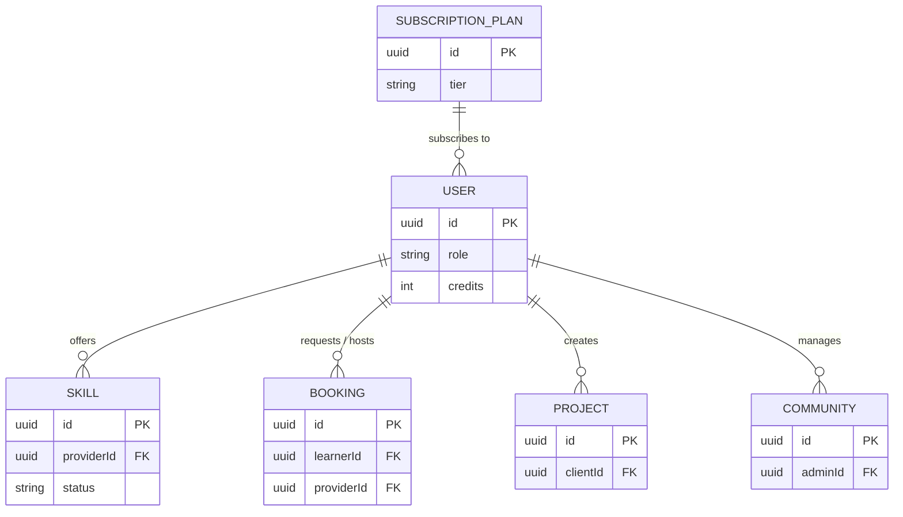

<div align="center">
  <h1>SkillForge</h1>
  <p>An Enterprise-Grade Skill-Sharing, Mentorship, and Collaboration Platform</p>
  
  [](https://opensource.org/licenses/MIT)
  [](https://www.typescriptlang.org/)
  [](https://nodejs.org/)
  [](https://reactjs.org/)
  [](https://www.prisma.io/)
</div>

<br/>

## 📖 Table of Contents
- [Project Highlights](#-project-highlights)
- [Architecture Overview](#-architecture-overview)
- [Technology Stack](#-technology-stack)
- [System Workflows](#-system-workflows)
- [Database Schema](#-database-schema)
- [Folder Structure](#-folder-structure)
- [Getting Started](#-getting-started)
- [Security Practices](#-security-practices)
- [Contributing](#-contributing)

---

## 🌟 Project Highlights

SkillForge transforms peer-to-peer learning by combining real-time communication with a secure virtual economy and AI-powered recommendations. 

### Feature Matrix

| Category | Features |
|:---|:---|
| **Core Mentorship** | 📹 1-on-1 WebRTC Video Sessions <br/> 📅 Automated Interview Scheduling <br/> 💬 Real-Time Chat & File Sharing |
| **Virtual Economy** | 💳 Stripe Payment Gateway Integration <br/> 🏦 Credit-Based Wallet System <br/> 🛡️ Project Milestone Escrow Contracts |
| **AI & Automation** | 🧠 Google Gemini 1.5 Project/Talent Matching <br/> 🤖 BullMQ Background Cron Jobs <br/> 📝 Automated MCQ Skill Verification |
| **Community & Social** | 🌐 Dedicated Interest Communities <br/> 📌 Message Pinning & Emoji Reactions <br/> 🏆 User Rating & Review System |
| **Admin Controls** | 📊 Comprehensive Dashboard Analytics <br/> 🚫 Content Moderation & User Suspension <br/> 💰 Withdrawal Request Processing |

---

## 🏛️ Architecture Overview

The system strictly adheres to **Clean Architecture** principles and **SOLID** design patterns, separating business rules from frameworks and ensuring high maintainability.

### System Architecture Diagram

```mermaid
graph TD
    Client["React Frontend (Vite)"]
    API["Express API Gateway"]
    
    subgraph Infrastructure Layer
        Stripe["Stripe Payments"]
        Gemini["Google Gemini AI"]
        S3["AWS S3 Storage"]
        Redis["Redis (Cache & BullMQ)"]
        Postgres[(PostgreSQL)]
    end

    subgraph Application Layer
        UseCases["Use Cases (Business Logic)"]
        DTOs["Data Transfer Objects (Zod)"]
    end

    subgraph Domain Layer
        Entities["Domain Entities"]
        Interfaces["Interfaces"]
    end

    Client -- HTTP / REST --> API
    Client -- Socket.io / WebRTC --> API
    
    API -- Presentation --> UseCases
    UseCases -- Interacts --> Interfaces
    Interfaces -- Implemented by --> Infrastructure Layer
    
    Infrastructure Layer -- Persists --> Postgres
    Infrastructure Layer -- Syncs --> Redis
    Infrastructure Layer -- AI Analysis --> Gemini
```

---

## 💻 Technology Stack

* **Frontend:** React, TypeScript, Tailwind CSS, Redux Toolkit, Redux Persist, Socket.io-client, Shadcn/UI
* **Backend:** Node.js, Express.js, TypeScript, InversifyJS (Dependency Injection)
* **Database:** PostgreSQL, Prisma ORM
* **Caching & Queues:** Redis, BullMQ
* **Real-Time:** Socket.io, WebRTC (STUN/TURN)
* **Third-Party Services:** AWS S3 (Storage), Stripe (Payments), Google Gemini (AI), Nodemailer (Transactional Emails)

---

## 🔄 System Workflows

### Authentication & Authorization Flow
SkillForge implements robust, stateless authentication using HTTP-Only cookies.



### Escrow & Payment Flow
To protect both learners and providers, all major transactions utilize a custom escrow system.
1. **Initiation:** The Learner pays upfront (via Stripe or Wallet Credits).
2. **Escrow Held:** Funds are locked in the database via escrow records.
3. **Delivery:** The Provider delivers the session or project milestone.
4. **Completion:** The Learner approves completion via the system.
5. **Release:** Funds are transferred to the Provider's wallet minus platform fees.

---

## 🗄️ Database Schema

The PostgreSQL database is managed via Prisma. The relationships revolve heavily around the `User` entity acting in both `Provider` and `Learner` roles.



---

## 📂 Folder Structure

### Backend (`skillForge-api`)
```text
src/
├── application/       # Use Cases, DTOs, Validation Schemas (Zod)
├── config/            # Environment parsing, Logger, Constants
├── domain/            # Entities, Custom Errors, Repository Interfaces
├── infrastructure/    # Prisma, Redis, BullMQ, AWS S3, Stripe integrations
│   └── di/            # InversifyJS container and types
├── presentation/      # Express Controllers, Routes, and Middlewares
└── shared/            # Common helpers and type definitions
```

### Frontend (`skillForge-client`)
```text
src/
├── api/               # Axios instances and API interceptors
├── components/        # Reusable UI components (Auth, Layouts)
├── hooks/             # Custom React hooks
├── pages/             # Route-level components (Admin, User, Provider)
├── routes/            # AppRoutes.tsx (Protected/Guest routing logic)
└── store/             # Redux configuration and slices (Auth, Skills)
```

---

## 🚀 Getting Started

### Prerequisites
- Node.js (v18+)
- PostgreSQL Database
- Redis Server (Required for BullMQ & Rate Limiting)
- Active accounts/keys for AWS S3, Stripe, and Google Gemini AI

### Installation

1. **Clone the repository:**
   ```bash
   git clone https://github.com/yourusername/SkillForge.git
   cd SkillForge
   ```

2. **Setup the Backend:**
   ```bash
   cd skillForge-api
   npm install
   
   # Setup environment variables (copy .env.example if available)
   cp .env.example .env 
   
   # Generate Prisma client and push schema to PostgreSQL
   npx prisma generate
   npx prisma db push
   
   # Optional: Seed the database with demo accounts (demo@skillforge.com / admin@skillforge.com)
   npm run seed 
   
   # Start the development server
   npm run dev
   ```

3. **Setup the Frontend:**
   ```bash
   cd ../skillForge-client
   npm install
   
   # Setup environment variables
   cp .env.example .env
   
   # Start the React Vite server
   npm run dev
   ```

---

## 🛡️ Security Practices

- **Token Storage:** JWT Access and Refresh tokens are strictly stored in HTTP-Only cookies to mitigate XSS vulnerabilities.
- **Atomic Operations:** Redis Lua scripts are utilized for rate-limiting to prevent race conditions and double-counting.
- **Strict Validation:** The `application` layer utilizes `Zod` schemas to strictly parse and validate all incoming DTOs before they reach domain logic.
- **Immediate Invalidation:** `authMiddleware.ts` queries the database to actively check the user's `isActive` flag, ensuring suspended accounts are terminated instantly across all sessions.

---

## 🤝 Contributing

We welcome contributions! Please adhere to the following workflow:

1. Fork the Project
2. Create your Feature Branch (`git checkout -b feature/AmazingFeature`)
3. Ensure strict adherence to Clean Architecture principles. Do not bypass the Domain layer!
4. Commit your Changes (`git commit -m 'feat: add amazing feature'`)
5. Push to the Branch (`git push origin feature/AmazingFeature`)
6. Open a Pull Request

## 📄 License
This project is licensed under the MIT License - see the LICENSE file for details.
